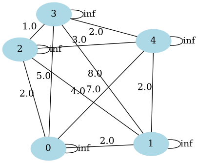
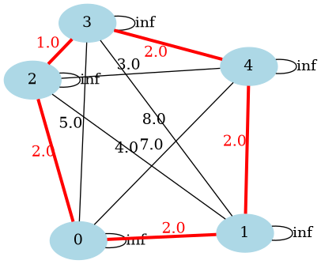

# Ant Colony Optimization
## Introduction
This is a python implementation of the Ant Colony Optimization algorithm. The distances between each node is defined in the variable `distances` in the `aco.py` file. The algorithm will find the shortest path between the nodes.

For example we have the following distance matrix:
```python
distances = np.array(
        [
            [np.inf, 2, 2, 5, 7],
            [2, np.inf, 4, 8, 2],
            [2, 4, np.inf, 1, 3],
            [5, 8, 1, np.inf, 2],
            [7, 2, 3, 2, np.inf],
        ]
    )
```
|       | **0** | **1** | **2** | **3** | **4** |
|-------|-------|-------|-------|-------|-------|
| **0** | $\infty$   | 2     | 2     | 5     | 7     |
| **1** | 2     | $\infty$    | 4     | 8     | 2     |
| **2** | 2     | 4     | $\infty$    | 1     | 3     |
| **3** | 5     | 8     | 1     | $\infty$    | 2     |
| **4** | 7     | 2     | 3     | 2     | $\infty$    |

Which can be visualized as:

<p align="center">
  
</p>

The algorithm will find the shortest path between the nodes. The path is defined as a list of tuples, where each tuple is a connection between two nodes. The first element of the tuple is the starting node and the second element is the ending node. The algorithm will also return the total distance of the path.

```
([(0, 2), (2, 3), (3, 4), (4, 1), (1, 0)], 9.0)
```

Which can be visualized as:

<p align="center">
  
</p>


## Requirements
You can install the requirements by executing the following command:
```sh
pip install -r requirements.txt
```

## Usage
The algorithm can be run by executing the `aco.py` file. The algorithm can be configured by changing the variables in the `aco.py` file. The variables are:
- `distances`: The distance matrix between the nodes.
- `n_ants`: The number of ants.
- `n_bes`: The number of best ants who will deposit pheromones.
- `n_iterations`: The number of iterations.
- `decay`: The decay rate of the pheromones.
- `alpha`: The alpha parameter.
- `beta`: The beta parameter.

### Execute Script
```sh
python aco.py
```

## Results


## References
- [Ant Colony Optimization](https://en.wikipedia.org/wiki/Ant_colony_optimization_algorithms)
- [Ant Colony Optimization for the Traveling Salesman Problem](https://www.researchgate.net/publication/220878660_Ant_Colony_Optimization_for_the_Traveling_Salesman_Problem)

## License
This project is licensed under the terms of the MIT license.
